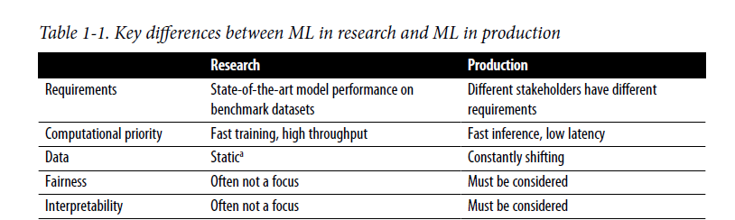

**Relationship between MLOps and ML Systems Design**
Production = deploying, monitoring, maintainance

Before starting a ML project, ask if ML is necessary or cost-effective?

**Machine learning is an approach to learn complex patterns from existing data and use these patterns to make predictions on unseen data**

- Many companies follow a "fake it till you make it" approach: launching a product to serve predictions made by humans, instead of ML models, with the hope of using generated data to train ML models later
- Unseen data and training data should come from similar distributions
- ML is suitable when cost of wrong prediction is low (eg. recommender systems)

*Having multiple objectives = develop 1 model for each objective and combine their predictions*

**Definitions**
- Latency: Time it takes from receiving a query to returning the result
- Throughput: How many queries it processes within a specif period of time
* When processing queries one at a time, higher latency = lower throughput
* When processing queries in batches, higher latency might also mean higher throughput
* To measure average latency, its better to use percentiles than average (why?)
* Using higher percentile numbers can be useful to prepare the system for the worst case

**Data** 
Its often noisy, possibly unstructured and constantly shifting in production

**Fairness**

**Interpretability**
Developing trust and detect potential biases in a model is essential for stakeholders