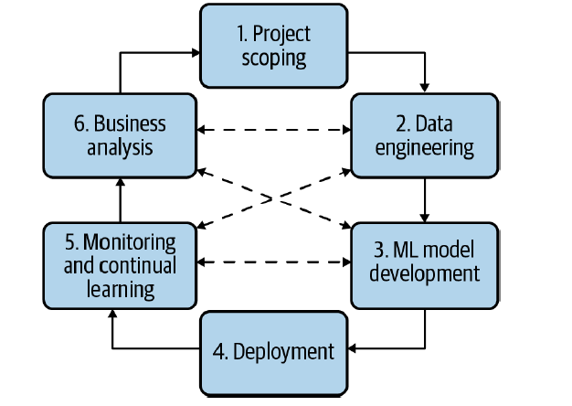
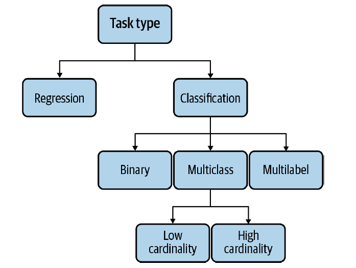

Business metrics are more important than marginal accuracy gains
Many companies create their own business metrics to map to ML metrics

### Requirements for ML Systems

**Reliability**
- The system can make a prediction, but it can be wrong (which cannot be interpreted by a user)

**Scalability**
- With more models deployed into production, you need to automate monitoring and retraining aspect

**Maintainability**
- Important to structure workloads and set up infra for different contributors to be comfortable.
- Code has to be documented. Code, data, artifacts have to be versioned

**Adaptability**
- Data changes quickly, hence model training must be adaptable

## Iteration in deploying ML models

**1. Project Scoping:** scoping the project, laying out goals, objectives and constraints. Stakeholders identified and involved. Resources estimated and allocated.

**2. Data Engineering:** Handling data from different sources and formats.

**3. ML model development:** extract features and develop initial models

**4. Deployment**

**5. Monitoring and continual learning:** monitor for performance decay and made adaptive to changing environment/requirements

**6. Business analysis:** evaluation against business goals

## Types of ML tasks

**Decoupling Objectives**
One approach is to combine 2 losses into 1 and train model to minimize the loss

$loss = \alpha qualityLoss + \beta engagementLoss$

Second approach is to train 2 different models, combine models' output and rank posts to their combined scores. (better approach)

$\alpha qualityScore + \beta engagementScore$