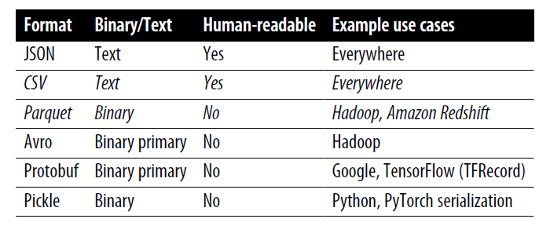
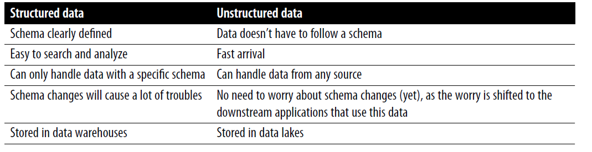

## Data Sources

- user-input data: very messy, can be malformatted, error filled. Also, users expecting output expect very low latency
- system-generated data: various logs and system outputs

**Data Serialization:** Process of converting a data structure or object state into a format that can be stored or transmitted and reconstructed later

Common Data Formats

**JSON (Javascript Objecy Notation)**
- key-value pair paradign to handle different levels of structuredness
- json schemas are hard to edit once committed

*CSV (comma seperated values) is row major, Parquet is column major* Row major data access is faster for computers due to sequential nature
- CSV and JSOn are text files, Parquet are binary files
- Parquet files are smalled in size due to the binary nature

### Data Models

**Relational Models:**
- Accessed via query language
- Declarative language: You specify the outputs you want, and the computer figures out the steps needed to get the queried outputs
- Imperative language: You specify the steps needed for an action and the computer executes these steps to return the outputs
- Declarative ML is being researched (H2O AutoML). You mention the feature schema and output, it figures out the best model architecture

**NoSQL**
- Not only SQL models can also support relational models (eg document model, graph model)
- Document model: single continuous string (eg JSON, XML, Binary JSON)
- Each document has a unique key for retrieval. Document model doesnt enforce any schema (called schemaless)
- Document dbs have each document in priority, graph dbs have relationships between data items as priority.
- Repository for storing structured data is a data warehouse. Repository for storing unstructured data is called data lake.

### Data Storage Engines and Processing

Workloads dbs are optimized for-

**Transactional & Analytical Processing**
- Transaction refers to any kind of action. Transactions are inserted as they are generated, occasionally updated when something changes, or deleted when no longer needed. This is called *Online Transaction Processing (OLTP)*
- Since they r user driven, they have low latency, high availability requirements.

- **ACID**
- Atomicity: guarantee all steps ina transaction are completed. If one fails, all should fail
- Consistency: all transactions must follow predefined rules
- Isolation: Guarantee 2 transactions happen at the same time as if they were isolated.
- Durability: once a transaction is committed, it remains committed even in a case of system failure

*Online Analytical Processing (OLAP)*: Effecient for queries that allow to look at data from multiple viewpoints

**Why OLTP and OLAP are outdated?**
1. Transactional & analytical dbs have combined these days (eg. CockroachDB is transactional that can handle analytical, Apache Iceberg and DuckDB vice-versa)
2. How data is stored is how data is processed. Now, storage is decoupled with processing (vendors like Google's BigQuery, Snowflake, IBM, Teradata have adopted)
3. Online = feature has been deployed to production (word has different meanings)

### Extract, Transform, Load (ETL)

### Dataflow

**1. Data passing through databases:** (2 process can be on different systems, R/W from databases can be slow where user requires low latency)

**2. Data passing through services using requests such as REST and ZRPC APIs (eg. POST/GET requests):** This is request-driven approach.
REST = Representational State Transfer (request over netwroks)
RPC = Remote Procedure Call (tries to make a call to a remote netwrok service)

**3. Data passing through real-time transport like Apache Kafka and Amazon Kinesis:** Having a broker db where all services can broadcast their data. 
A piece of data transport to real-time transport is called an event. This architecture is event-driven. Real-time transport is called event-bus (eg. pubsub eg Apache Kafka, Amazon Kinesis)

### Batch v/s Stream Processing
- Historical data in dbs/data warehouses/data lakes is processed in batch jobs
- Data in real-time transports is streaming data
- Stream processing can give low latency (dont write to db, low data based on the day)
- Batch processing usually used to compute features that change less often. Batch features, extracted from batch processing, are called static features
- Stream processing is used to compute features that change quickly. Features extracted through stream processing are called dynamic features

