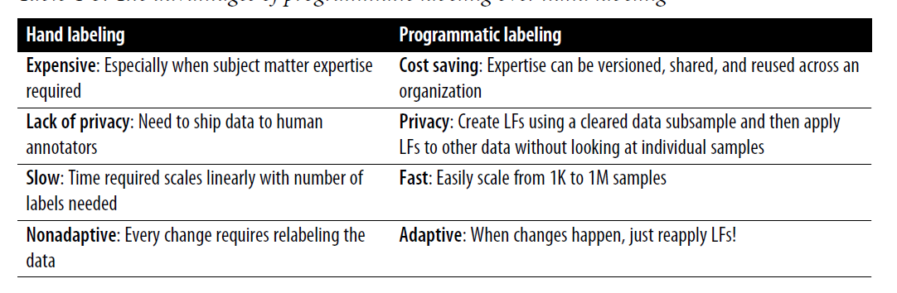
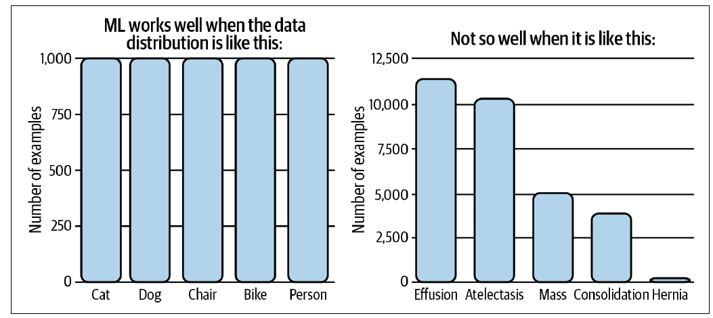

Training data = data in production (neither finite nor stationary)
Training dataset = finite and stationary

## Sampling

### Nonprobability Sampling

**1. Convenience Sampling:** selected based on availability

**2. Snowball sampling:** Future samples are selected based on existing samples (eg scrape twitter for small no of accounts, scrape all accounts they follow)

**3. Judgement sampling:** experts decide what samples

**4. Quota sampling**

There's a possibility of selection biases.

### Simple Random Sampling

All samples given equal probability.

### Stratified Sampling

Dividing population into groups and sample from each group seperately. Each group is called stratum. For multilabel tasks, this method is not possible.

### Weighted Sampling

Each sample given a weight before sampling

### Reservoir Sampling

**Reservoir Algorithm**

1. Put the first k elements into the reservoir
2. For each incoming nth element, generate a random number i such that 1 ≤ i ≤ n
3. If 1 ≤ i ≤ k: replace the ith element in the reservoir with the nth element. Else, do nothing

Each element has $\frac{k}{n}$ probabilty of getting in the reservoir.

### Importance Sampling

## Labeling

### Hand Labels
- Too much expertise required
- Poses data privacy threat
- Too slow

**Label multiplicity:** different annotators lead to different levels of accuracy. This is called label ambiguity or label multiplicity
To minimize disagreement within annotators, clear definition of problem statement is required

**Data Lineage:** Annotators changed for new data, quality decreases

### Natural Labels

- Labels that are generated naturally (eg user clicking a recommendation, preciting stock price after 2 min and getting actual value after 2 min)
- Natural labels inferred from user behaviors like clicks and ratings are called **behavioral labels**
- A recommendation that doesn't get clicked on after a period of time is presumed bad, called implicit label
- Explicit label, user provides feedback, be it positive or negative
- Long/short feedback loop are highly responsible on how u can obtain natural labels

### Handling lack of labels

**Weak supervision:** Weak labelling using keyword heuristics, regular expressions etc

**Semi Supervision:** 
- Classic technique is self-training- train a model on existing labels to make predictions. Retrain from labels with high probability.
- Another technique could be clustering labels
- Perturbation method- apply small perturbations to your training instances to obtain new training instances
- Semi-supervision is useful when no of training labels are limited.

**Transfer Learning:**
- Model developed for a task is reused as starting point for a model on a second task
- Example, using pretrained models for downstream tasks

**Active Learning:**
- Also called query learning
- Label samples that are most helpful to the model

## Class Imbalance

Class imbalance makes precidiction difficult-
- class imbalance often means there's insuffient signal for your model to learn
- model can be stuck to nonoptimal solution by exploiting simple heuristic
- asymmetric costs of error

### Handling Class Imbalance

**Use the right eval metrics:** F1, Recall, Precison

**Data-level methods:** Resampling

