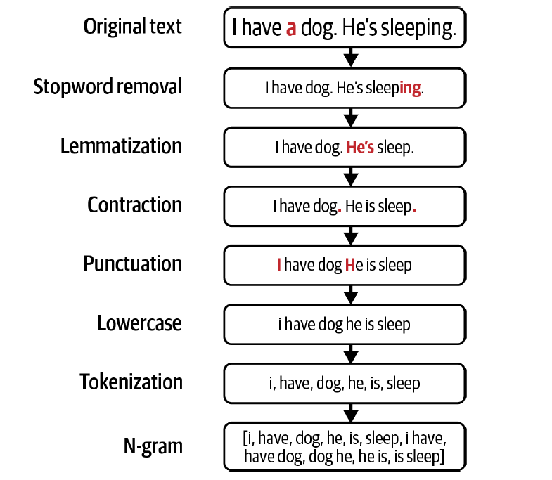

**Crafting n-gram features from text**

## Feature engineering operations

### Handling missing values

- **Missing not at random (MNAR):** The reason the value is missing is because of true value itself (eg people not disclosing incomes)

- **Missing at random (MAR):** 